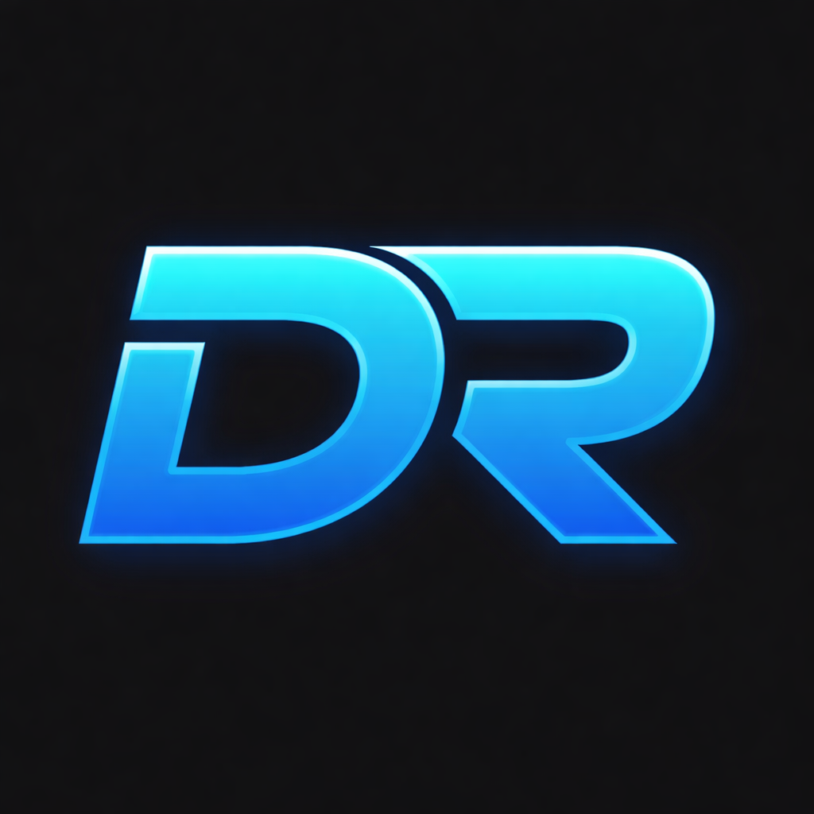

# DR Icon Changer

<p align="center">
  
</p>

<p align="center">
  <strong>Customize your Diminishing Returns icons in World of Warcraft: Midnight (12.0+)</strong>
</p>

<p align="center">
  <a href="https://github.com/Sammers21/dr-icon-changer/releases/latest">
    
  </a>
  <a href="https://github.com/Sammers21/dr-icon-changer/releases/latest">
    
  </a>
</p>

> **Is this bannable?** No. This tool works the same way WoW addons do — it creates an `Interface/ICONS` folder inside your WoW directory and places icon files there. WoW natively supports loading custom icons from this folder. **No game files are modified or replaced.** Projects like [Clean Icons - Mechagnome Edition](https://github.com/AcidWeb/Clean-Icons-Mechagnome-Edition) have used the exact same approach since 2022 with zero issues.

---

## 🎮 What is this?

DR Icon Changer is a simple desktop application that lets you customize the **Diminishing Returns (DR) icons** displayed by arena addons like [Gladius]([https://www.curseforge.com/wow/addons/gladius](https://www.curseforge.com/wow/addons/gladius-updated-by-sammers21), [sArena](https://www.curseforge.com/wow/addons/sarena-edited-by-sammers), and others in **World of Warcraft: Midnight (12.0+)**.

By default, DR trackers use generic spell icons that can be hard to distinguish at a glance. This tool lets you replace them with more recognizable icons that match your preferences.

<p align="center">
  
</p>

## ✨ Features

- 🎯 **Customize DR Categories**: Change icons for Stun, Incapacitate, Fear, and Root DR categories
- 🖼️ **High-Quality Icons**: Uses upscaled TGA icons for crisp visuals
- 💾 **Remembers Your WoW Folder**: No need to re-select your installation every time
- ⚡ **Instant Application**: Changes are applied immediately to your WoW installation
- 🔄 **Easy Reset**: One-click reset to restore all default icons
- 🎮 **Multi-Version Support**: Works with Retail, PTR, Beta, and other WoW versions

## 📥 Installation (Windows only)

1. Download the latest `.msi` installer from the [Releases page](https://github.com/Sammers21/dr-icon-changer/releases/latest)
2. Run the installer and follow the prompts
3. Launch **DR Icon Changer** from your Start Menu

> **⚠️ Windows SmartScreen / Smart App Control warning**: Windows may show a warning saying it blocked the application because it can't confirm who published it. This is expected — the app is not currently signed with a paid code-signing certificate. **The app is completely safe** and the source code is fully open for review.
>
> **To bypass the warning:**
>
> - Click **"More info"** on the SmartScreen popup, then click **"Run anyway"**
> - If you have **Smart App Control** enabled and there is no "Run anyway" option, go to **Settings → Privacy & Security → Windows Security → App & browser control → Smart App Control** and set it to **Off** or **Evaluation** mode, then try again

## 🚀 Usage

1. **Select your WoW folder** - Point the app to your World of Warcraft installation directory
2. **Choose your WoW version** - Select Retail, PTR, Beta, etc.
3. **Pick your icons** - Click on any DR category and choose your preferred icon
4. **Restart WoW** - A full game restart is required for changes to take effect (`/reload` won't work)

## ⚠️ Important Notes

- **Full game restart required**: After changing icons, you must completely close and reopen World of Warcraft. Using `/reload` will not apply the changes.
- **Icon sharing**: Changing a DR icon will also affect other abilities that use the same base texture (e.g., changing the Stun DR icon will also change Concussive Shot's appearance)

## 🔧 Building from Source

### Prerequisites

- [Node.js](https://nodejs.org/) (v20+)
- [Rust](https://rustup.rs/)
- [Tauri CLI](https://tauri.app/)

### Development

```bash
# Install dependencies
npm install

# Run in development mode
npm run tauri dev

# Build for production
npm run tauri build
```

## 📄 License

This project is open source and available under the [MIT License](LICENSE).

## 🙏 Credits

- **[@Bicmex](https://www.twitch.tv/bicmex)** - For the idea and help with finding the right spell and file names
- **[Clean Icons - Mechagnome Edition](https://github.com/AcidWeb/Clean-Icons-Mechagnome-Edition)** - For the beautiful upscaled icons

## 🤝 Contributing

Contributions are welcome! Feel free to open issues or submit pull requests.

---

<p align="center">
  Made with ❤️ for the WoW PvP community
</p>
